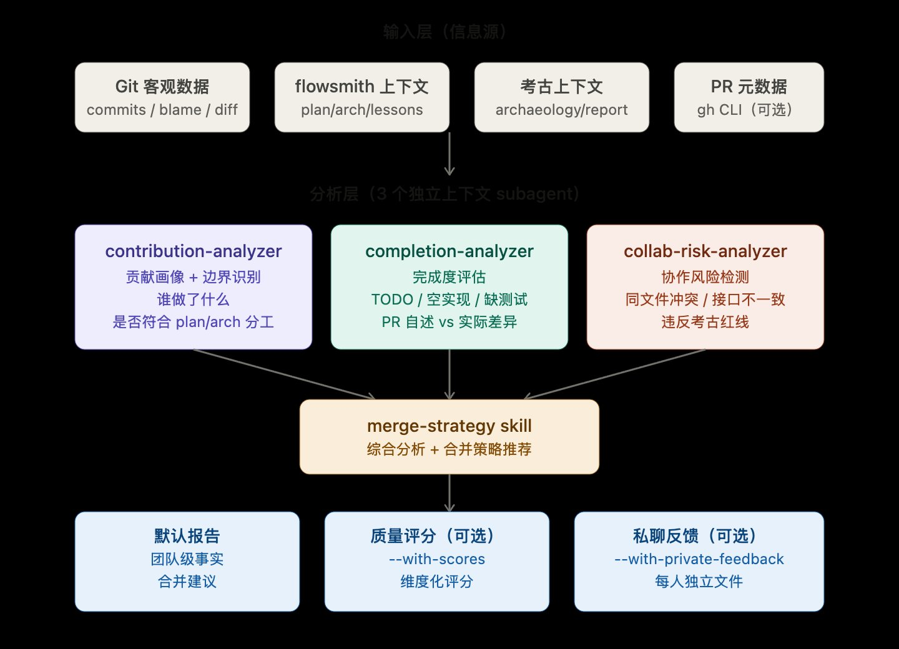

# co-review — Claude Code Plugin

> 由 [Velpro](mailto:xvelpro8@gmail.com) 开发，发布在 [buddy-hub](https://github.com/KaverinX/buddy-hub) marketplace。

**团队协作审查工具**。当多位开发者在同一分支协作时，
派遣三个独立 analyzer 从不同维度审视团队工作的健康度，
输出可执行的合并策略与个人级行动建议。

> "代码审查告诉你代码对不对。
>  团队审查告诉你团队协作对不对。"

---

## 设计哲学

flowsmith 的 `/sop-review` 是**纵向**的——审查每段代码本身的质量。
co-review 是**横向**的——审查多人协作产生的工作组合是否健康。

它们互不冲突，互相补充：

```
flowsmith /sop-review   →  代码本身：架构/安全/逻辑（按文件深度审查）
co-review /scope-review →  团队协作：贡献/完成度/风险（按人横向审查）
```

---

## 完整架构

co-review 是一个**三层架构**的协作审查系统：信息源 → 分析层 → 输出层。



### 第一层：输入层（信息源）

co-review 综合**四类信息源**来分析团队协作。来源越丰富，输出越有深度：

#### 🟢 Git 客观数据（地基，最可信）

所有数据来自 `git` 命令，不依赖 LLM 推断：

- **提交元数据**：`git log --pretty=format:'%h|%an|%ae|%ad|%s|%P'` 拿到 commit hash、作者、邮箱、时间、message、父 commit
  - 通过父 commit 数 > 1 自动识别 merge commit
  - 邮箱 local-part 相同视为同人（处理同人多邮箱）
- **改动量统计**：`git log --numstat`，自动过滤构建产物（`*.lock`、`dist/`、`target/`、`node_modules/` 等）
- **文件级 blame**：`git blame -w -C ${BASE} -- <file>`，识别每个文件本次分支启动**前**的真实主要维护者
- **文件交集分析**：识别多人修改的文件、行级冲突区域
- **时间分布**：每位作者的第一次/最后一次提交、提交频率

#### 🔵 flowsmith 上下文（独家协同）

仅当项目使用 flowsmith 时可用：

- `.sop/plan.md` — 子任务定义，用于"实际承担者 vs 计划承担者"匹配
- `.sop/arch.md` — 模块职责定义，用于越界检测
- `.sop/review.md` — 上轮审查问题，用于"是否真正修复"对比
- `.sop/lessons.md` — 历史踩坑记录，用于实时重蹈覆辙检测
- `.sop/state.json` — 关联当前 flowsmith 任务 ID

#### 🟠 考古上下文（独家协同）

仅当用过 code-archaeologist 时可用：

- `.archaeology/report.md` 中的"不可跨越的红线" — 用于违反检测
- `.archaeology/report.md` 中的"重构前置条件清单" — 用于评估前置条件是否满足
- 红线本身就是 collab-risk-analyzer 的高优先级输入

#### 🟡 PR 元数据（可选，需 gh CLI）

通过 `gh pr view` 拉取：

- PR 描述（开发者自述完成了什么）
- 关联的 issue/ticket 编号
- 用于"声称完成 vs 实际完成"的偏差分析

> **降级保证**：缺少任何信息源都能工作。完整 4 类来源 → 深度协同分析；仅 git 数据 → 基础团队审查。

---

### 第二层：分析层（3 个独立上下文 subagent）

每个 analyzer 有**自己的独立上下文窗口**，避免分析维度互相污染。
每个 analyzer 都有**禁止做**的事，确保单一职责：

#### 📊 contribution-analyzer — 贡献画像 + 边界识别

**它回答**：谁做了什么？是否符合 plan/arch 分工？

具体输出：
- **贡献画像表**：每人 commits/LOC/文件数/主要模块/时间跨度
- **模块分布矩阵**：每个模块被哪些人改过（识别多人交集）
- **子任务对应表**（若 plan.md 存在）：plan.md 中每个子任务对应到实际 commits，识别"未启动 / 进行中 / 完成"，发现"未匹配的子任务"和"计划外的工作"
- **越界提交标记**（若 arch.md 存在）：基于模块职责定义识别越界，区分"合理越界"（< 20 行 + commit message 说明）与"不合理越界"
- **代码所有权地图**：本人维护 / 跨人维护 / 替代维护

**禁止做**：不评判质量、不分析风险、不判断对错。
跨人维护本身**不是问题**，只是信息提示。

#### ✅ completion-analyzer — 完成度评估

**它回答**：代码是否真的"做完了"？合并进 main 会不会变烂尾？

扫描的"完成度信号"：
- **TODO/FIXME/XXX/HACK/TBD/REFACTOR** 标记，按作者分组
- **空实现**：根据语言识别（Java 的 `throw new UnsupportedOperationException`、TS 的 `() => {}`、Python 的 `pass`/`raise NotImplementedError`、Go 的 `panic("todo")`、Rust 的 `unimplemented!()` 等）
- **注释掉的代码块**：连续 3+ 行包含代码标点的注释
- **调试遗留**：`console.log`、`System.out.println`、`debugger;`、`pdb.set_trace()` 等（自动排除合理使用）
- **测试同步性**：每个新增/修改的源文件是否有对应的测试文件（按 Java/TS/Python/Go/Rust 各自的命名规范判断）

**完成度等级**：
- 🟢 高：TODO=0 + 测试同步率 ≥ 70% + 无调试遗留 + 无空实现
- 🟡 中：少量 TODO + 测试同步率 30-70%
- 🔴 低：大量 TODO 或缺测试或有 critical 调试遗留

**特殊降级**：critical 调试遗留（`debugger;`、`pdb.set_trace()`）→ 强制 🔴；空实现是 public API → 强制 🔴。

**PR 自述偏差**（仅 gh CLI 可用时）：提取 PR 描述中的"已完成项"列表，对比实际代码中的 TODO/空实现，输出"声称完成但实际未实现"清单。

**禁止做**：不评判态度、不揣测意图、不臆断"是否会完成"。

#### 🛡️ collab-risk-analyzer — 协作风险检测

**它回答**：多个人的工作组合在一起会不会出事？

扫描的 4 类风险：

| 风险类别 | 检测方式 | 等级判定 |
|---------|---------|---------|
| **同文件多人改动** | git log 多作者交集 + 行级范围重叠 | 不重叠 🟢 / 重叠不冲突 🟡 / 重叠且语义可能冲突 🔴 |
| **接口签名不一致** | diff 中签名变更 + grep 调用方是否同步 | 调用方仍可编译 🟡 / 调用方编译失败 🔴 / 跨人变更未通知 🔴 |
| **违反考古红线** | 逐条对照 archaeology/report.md 的红线 | 永远 ⛔ critical |
| **重蹈历史覆辙** | 逐条匹配 lessons.md 的踩坑记录 | 安全相关 🔴 / 性能可维护性 🟡 / 部分匹配 🔵 |

每条风险都**归因到具体的 author**，列出参与者、位置、具体建议。

**禁止做**：不分析单人代码质量、不集体责任化、不模糊判断。
风险描述必须具体可验证，不接受"可能存在风险"这种表述。

---

### 第三层：综合与输出（merge-strategy skill）

3 个 analyzer 完成后，`merge-strategy` skill 综合三份报告生成最终输出。

#### 决策流程（节选自决策树）

```
节点 1：违反考古红线？
  是 → team_health = ⛔ critical, strategy = block-and-discuss

节点 2：完成度极差（🔴 + critical 调试遗留）？
  是 → team_health = 🔴 unhealthy, strategy = escalate

节点 3：跨人接口冲突（🔴 高）？
  是 → team_health = 🔴 unhealthy, strategy = coordinate-first

节点 4：多人改动同文件且行重叠（🔴 高）？
  是 → team_health = 🟡 warning, strategy = coordinate-first

节点 5：所有改动相互独立（无文件交集 + 无接口依赖 + 完成度 ≥ 🟡）？
  是 → team_health = 🟢 healthy, strategy = merge-now-all

节点 6：默认
  → strategy = staged-merge（按拓扑排序的合并顺序）
```

#### 5 种合并策略详解

| 策略 | 含义 | 触发条件 | 检查清单示例 |
|------|------|---------|------------|
| `merge-now-all` | 可批量合并 | 所有改动独立 + 完成度均 ≥ 🟡 | PR 描述与代码一致、CI 绿、各有 reviewer |
| `staged-merge` | 分阶段合并 | 改动可拓扑排序 | 按推荐顺序逐个合并、每次合并后 rebase main |
| `coordinate-first` | 先解决人际协调 | 接口冲突 / 行重叠 | 涉及人参加协调会议、达成接口/字段命名一致 |
| `block-and-discuss` | 暂停讨论 | 违反考古红线 | 暂停所有合并、召开会议、修复后重做 scope-review |
| `escalate` | 上报 lead | 完成度极差 + 团队级问题 | 通知 lead、准备问题清单与背景 |

#### 推荐合并顺序（拓扑排序）

构造作者依赖图：
- 节点 = 每位作者
- 边 = A → B 当 B 改动了 A 引入的接口/模块

输出排序：入度为 0 的节点（无依赖）优先 → 同层内完成度高的优先。

---

## 三类输出

### 1. 默认报告（必出）

`.team-scope/report.md`：**团队级事实**，不针对个人横向对比。

包含章节：
- 摘要（健康度 + 推荐策略）
- 团队贡献概览
- 完成度评估
- 协作风险
- 合并策略 + 推荐顺序 + 检查清单
- **个人行动建议**（针对每位开发者列出具体 todo，但不做横向对比）
- 引用文件（指向 contributions.md / completion.md / risks.md）

### 2. 维度评分（可选，`--with-scores`）

`.team-scope/scores.md`：**4 维度独立评分**，不给单一综合数值。

| 维度 | 含义 | 来源 |
|------|------|------|
| 完成度 | 代码是否完整可交付 | TODO 数 + 测试覆盖 + 调试遗留 |
| 协作健康 | 是否引入冲突或破坏接口 | 同文件冲突 + 接口签名变更通知 |
| 边界遵守 | 是否在 arch.md 定义的职责范围内 | 越界提交比例 |
| 经验吸收 | 是否避免了 lessons.md 中的已知坑 | 重蹈覆辙数 |

每个维度只有 🟢/🟡/🔴 三档。**每条评分必须附具体证据**（commit hash、文件:行号、覆盖率数据）。

文件头尾强制声明：
- ⚠️ 仅供团队回顾参考，不应用于个人绩效考核
- ⚠️ 评分由 git 数据自动生成，存在局限性（无法反映协作沟通、设计决策、跨任务知识传承）

### 3. 私聊反馈（可选，`--with-private-feedback`）

`.team-scope/private/<author>.md`：每位开发者一份**严格隔离**的独立文件。

**三大不可越界**（详见 `skills/merge-strategy/reference/private-feedback-tone.md`）：

1. **不评判态度** — 禁止"你工作很努力/马虎"，只接受事实陈述
2. **不做横向对比** — 文件中**禁止出现其他开发者的姓名、邮箱、统计**
3. **不出现对其他作者的评价** — 即使是正面的也禁止

文件头尾各一段强制声明：
- ⚠️ 仅作为个人参考
- ⚠️ 不应在团队群组公开传播
- ⚠️ 不代表对你工作的全面评价

文件命名按 sanitize 规则处理（如 `Alice Wong` → `alice_wong.md`，`张三` → `zhang_san.md`）。

> **隐私建议**：在项目 `.gitignore` 中加入 `.team-scope/private/`，避免反馈文件被意外提交。
> plugin 不会自动修改 .gitignore，决策权在你。

---

## 安装

```bash
# 添加 marketplace（一次性）
claude plugin marketplace add KaverinX/buddy-hub

# 安装 co-review
claude plugin install co-review@buddy-hub
```

需要的依赖：
- Claude Code v2.1+
- Git
- jq（TUI 看板与 hook 必需）
- gh CLI（可选，用于 PR 自述偏差分析）

---

## 命令清单

| 命令 | 用途 |
|------|------|
| `/scope-review` | 主命令：分析当前分支对比 base 的所有改动 |
| `/scope-status` | 查看上一次分析的状态 |
| `/scope-compare <a> <b>` | 对比两个分支的协作差异（PR review 前对比）|
| `/scope-individual <author>` | 单人详细画像（仅终端展示，不写文件）|

### `/scope-review` 完整参数

```
/scope-review
  [--base=main]                  # 基线分支，默认 main
  [--mode=pr|commit]             # 分析粒度，默认 pr
  [--with-scores]                # 启用维度化评分（默认关闭）
  [--with-private-feedback]      # 生成私聊反馈文件（默认关闭）
  [--with-rhythm]                # 工作节奏分析（v1 占位，默认关闭）
  [--ci-data=<path>]             # CI 报告路径
```

**关键设计**：`/scope-review` 自动获取**当前分支**作为分析目标，**不接受位置参数指定分支**。
你在哪个分支上，就分析哪个分支。这避免了"误分析其他分支"造成的认知偏差。

---

## TUI 可视化看板

co-review v1 内置了**纯终端可视化看板**（无 Web 依赖）：

```bash
bash $CLAUDE_PLUGIN_ROOT/scripts/tui/dashboard.sh
```

5 个面板，键盘快捷键切换：

```
┌─ co-review TUI Dashboard ─────────────────────────────────┐
│  Review: a3f8c1d2  |  feature/notify → main              │
│  Team Health: ● warning    Merge Strategy: staged-merge  │
├──────────────────────────────────────────────────────────┤
│ [1.Overview] 2.Contributions 3.Completion 4.Risks ...    │
│                                                          │
│  ─── 审查概况 ───                                         │
│  触发方式：    flowsmith-suggested                        │
│  分析模式：    pr                                         │
│  flowsmith 关联：a3f8c1d2                                 │
│                                                          │
│  ─── 数据统计 ───                                         │
│  作者数：      3                                          │
│  Commits：     27                                         │
│  代码量：      +1,789 / -287                              │
│                                                          │
│  ─── 分析员状态 ───                                       │
│  ✓ contribution-analyzer  done                           │
│  ✓ completion-analyzer    done                           │
│  ✓ collab-risk-analyzer   done                           │
└──────────────────────────────────────────────────────────┘
   1.Overview  2.Contributions  3.Completion  4.Risks  5.Strategy   r=refresh  q=quit
```

| 快捷键 | 面板 |
|-------|------|
| 1 | Overview — 审查概况、统计、状态 |
| 2 | Contributions — 贡献画像表格 |
| 3 | Completion — 完成度信号 |
| 4 | Risks — 协作风险与红线警示 |
| 5 | Strategy — 合并策略与检查清单 |
| r | 刷新（重新读取报告文件）|
| q | 退出 |

> Web 看板规划在 v2，v1 仅 TUI。

---

## 使用示例

### 场景 1：基础团队审查

```bash
# 切换到 feature 分支
git checkout feature/notification-system

# 启动审查（自动获取当前分支为目标，main 为 base）
/scope-review
```

输出：
```
🔍 团队协作审查启动
分支：feature/notification-system → main
作者数：3
Commits：27

[三个 analyzer 并行工作...]

✅ 团队协作审查完成
🎯 团队健康度：🟡 warning
🛠️  推荐合并策略：staged-merge

关键风险：
- 🔴 接口签名不一致：UserRepository.findById 已变更但 Bob 未同步调用
- 🟡 同文件多人改动：types/user.ts 第 12-18 行
- 🔵 越界提交：Alice 修改了 notification 模块的 router.ts

📺 启动 TUI 看板查看完整报告：
   bash $CLAUDE_PLUGIN_ROOT/scripts/tui/dashboard.sh
```

### 场景 2：启用所有可选选项

```bash
/scope-review --with-scores --with-private-feedback
```

额外产出：
- `.team-scope/scores.md` — 4 维度评分（带"不应用于绩效"声明）
- `.team-scope/private/<name>.md` — 每位开发者一份私聊反馈

### 场景 3：与 flowsmith 协同（自动触发）

```bash
# 你在做 flowsmith 任务
/sop-init 实现用户通知系统
# ... 走完 plan/arch/impl/optimize/review

/sop-review
# 三个 reviewer 完成后，hook 检测到本分支有多位作者协作

# 终端自动出现：
# [co-review] 💡 检测到 flowsmith 任务审查已完成，且当前分支由 3 位开发者协作。
# 强烈建议执行团队协作审查：/scope-review

# 你听从建议
/scope-review

# 它会读取 flowsmith 的 plan.md 做子任务匹配
# 读取 arch.md 做边界检查
# 读取 lessons.md 做重蹈覆辙检测
# 输出深度协同的报告
```

### 场景 4：PR review 前对比两分支

```bash
# 评估"如果合并 feature/A 进 feature/refactor-base 会有什么协作风险"
/scope-compare feature/A feature/refactor-base
```

---

## 文件目录

```
co-review/
├── .claude-plugin/plugin.json
├── README.md / CHANGELOG.md / LICENSE
├── commands/                            # 4 个命令
│   ├── scope-review.md                  # 主命令
│   ├── scope-status.md
│   ├── scope-compare.md
│   └── scope-individual.md
├── agents/                              # 3 个独立 analyzer
│   ├── contribution-analyzer.md
│   ├── completion-analyzer.md
│   └── collab-risk-analyzer.md
├── skills/
│   └── merge-strategy/
│       ├── SKILL.md
│       └── reference/
│           ├── scoring-rubric.md         # 评分规则
│           ├── merge-decision-tree.md    # 合并策略决策树
│           └── private-feedback-tone.md  # 私聊反馈语气规范
├── schemas/
│   ├── co-review-schema.md               # state.json 契约
│   └── report-schemas.md                 # 报告格式契约
├── hooks/
│   └── hooks.json                        # ⭐ flowsmith review 完成时建议
└── scripts/
    ├── detect-multi-author.sh            # PostToolUse hook 实现
    ├── lib/
    │   └── git-helpers.sh                # 共享工具函数
    └── tui/
        ├── dashboard.sh                  # ⭐ TUI 主入口
        └── tui-renderer.sh               # 渲染函数
```

项目运行时产出：

```
your-project/
└── .team-scope/
    ├── state.json
    ├── contributions.md
    ├── completion.md
    ├── risks.md
    ├── report.md                          # 主报告 ⭐
    ├── scores.md                          # 仅 --with-scores
    └── private/                           # 仅 --with-private-feedback
        ├── alice_wong.md
        ├── bob_smith.md
        └── carol_chen.md
```

---

## 设计原则

### 1. 默认基于"当前分支"
`/scope-review` 不接受位置参数指定分支，自动用 `git rev-parse --abbrev-ref HEAD`。
这避免了"我以为在分析 A 分支，实际在分析 B 分支"的认知偏差。

### 2. 默认不评分，不给私聊
质量评分（`--with-scores`）和私聊反馈（`--with-private-feedback`）默认**关闭**。
这是有意的——它们是双刃剑，需要团队明确选择启用。

### 3. 多 analyzer 独立上下文
3 个 analyzer 各自专精一个维度（贡献/完成度/风险），不互相污染。
contribution-analyzer 不评判质量，completion-analyzer 不分析风险，分而治之保证深度。

### 4. 行动建议针对个人，但隔离个人对比
主报告的"个人行动建议"章节列出每位开发者的 todo，但**不做横向对比**。
私聊反馈每人独立文件，**严格不出现其他人的信息**。

### 5. 不修改其他 plugin 的状态
co-review 只**读取** flowsmith 和 archaeology 的产出，不修改它们的 state.json。
plugin 间通过共享文件协同，不通过状态侵入。

---

## 配置开关

| 环境变量 | 默认 | 作用 |
|---------|------|------|
| `BUDDY_COREVIEW_AUTO_SUGGEST` | `1` | flowsmith review 完成时是否自动建议 scope-review |

---

## 隐私与安全

私聊反馈文件可能包含个人完成度信息。建议在项目 `.gitignore` 中加入：

```
.team-scope/private/
```

这样即使生成了反馈文件，也不会被意外提交到代码库。
plugin 不会自动修改 .gitignore，决策权在你。

---

## 后续规划

**v1.1**：
- `/scope-close` 命令——归档审查并将团队协作经验沉淀到 `.sop/lessons.md`
- 工作节奏分析（`--with-rhythm`）的实际实现
- CI 数据深度集成

**v2**：
- Web 可视化看板（基于 v1 TUI 验证的数据模型）
- 跨仓库依赖分析

---

## License

MIT © Velpro
